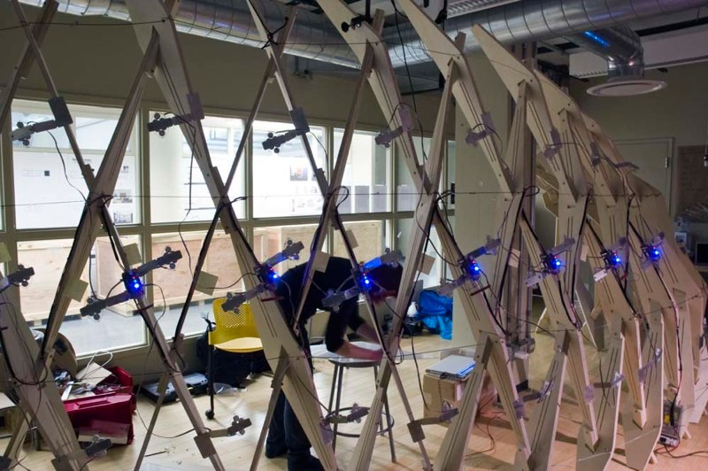
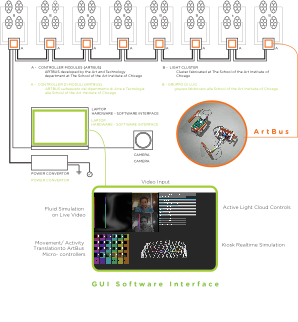
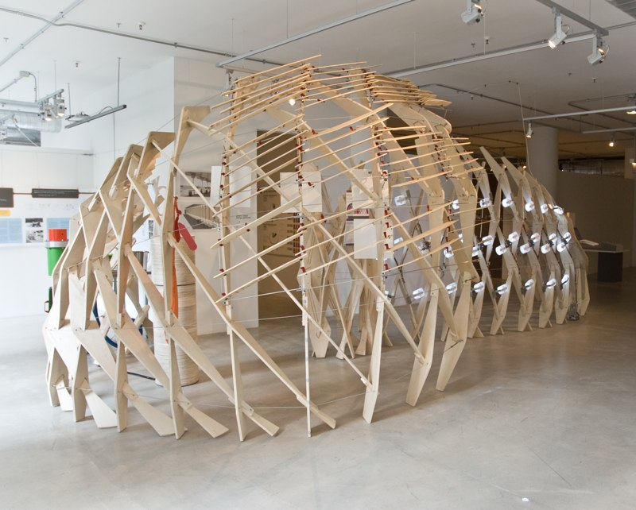
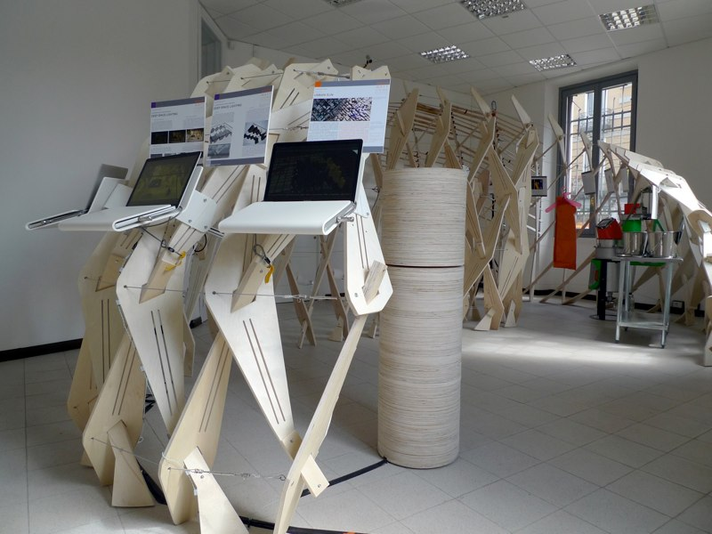
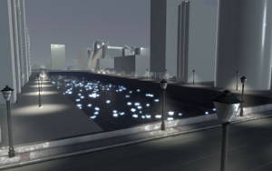

**An innovative approach to how we light the world of tomorrow.**

Active Light Cloud was a gesture-responsive lighting system that used advanced computer vision — developed in OpenFrameworks — to predict a user's particular lighting needs through movement. Users could throw light down a dark hallway or bring a cluster of task light to themselves with a single gesture. The conventional ceiling-grid lighting array, that fixed and uniform piece of architectural infrastructure, was reimagined as a medium for spatial dialogue.

The work began as my MFA thesis at the [School of the Art Institute of Chicago's](https://www.saic.edu) Department of Architecture, Interior Architecture, and Designed Objects (AIADO), under thesis advisor Anders Nereim. The system tracked bodies moving beneath the array using overhead computer vision and rendered the tracking data into a fluid simulation that, in turn, drove the lighting in real time.

It was, at root, a set of questions about energy, attention, ambient intelligence, and what happens when an architectural surface is given the means to respond. Those questions would shape much of my later practice across responsive architecture and experiential media — and continue, in different form, in the work I'm doing now on decision quality and AI-assisted decision coaching.

The thesis received the AIADO MFA Award of Academic Excellence (2010). The work was presented at the 2009 [ACADIA](https://acadia.org) Annual Conference at the Art Institute of Chicago, and at *The Bauhaus — From Laboratory to Project* international conference at [Bauhaus-Universität Weimar](https://www.uni-weimar.de) (October 2009, presented by Anders Nereim).

It was subsequently exhibited as part of the GFRY Design Studio's *2000 Watt Living* exhibitions in Chicago (Sullivan Galleries, 2010) and Milan (Fabrica del Vapore, 2010, concurrent with Salone Internazionale del Mobile / Milan Design Week).

