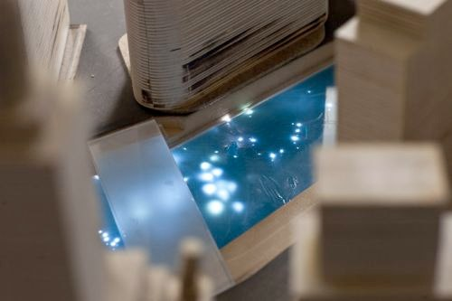
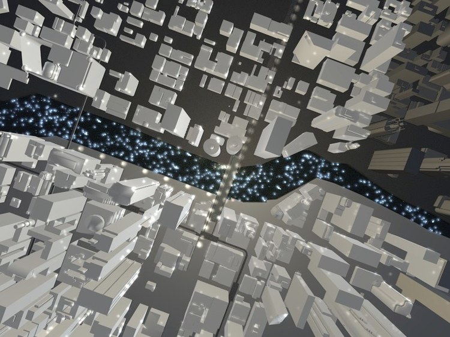

**A bridge not of steel and brick, but of light and space — not for the foot, but for the soul.**

Bridges is a proposal to install nearly 1,000 high-powered lights into the Chicago River bed between the Michigan Avenue and State Street bridges. The lights would be programmed to reflect the actual celestial bodies as they appear in the night sky overhead — bringing the wonder of the night sky back to the people of a city that, like most cities, has long since lost it.

The work asks what happens when a piece of urban infrastructure — the river — is given the means to register and reflect something that lives outside the city's normal field of vision. Reading Chicago by the stars, but using only equipment placed in the river bed: the proposal sits in the same line of inquiry as my later urban-computing projects, asking what hidden infrastructure can be made to speak.

Bridges was never built. As a proposal, it remains the clearest early articulation of the question that runs through my urban-computing strand: what are the conditions under which a city's infrastructure can be made legibly aware of what it is in the middle of?
