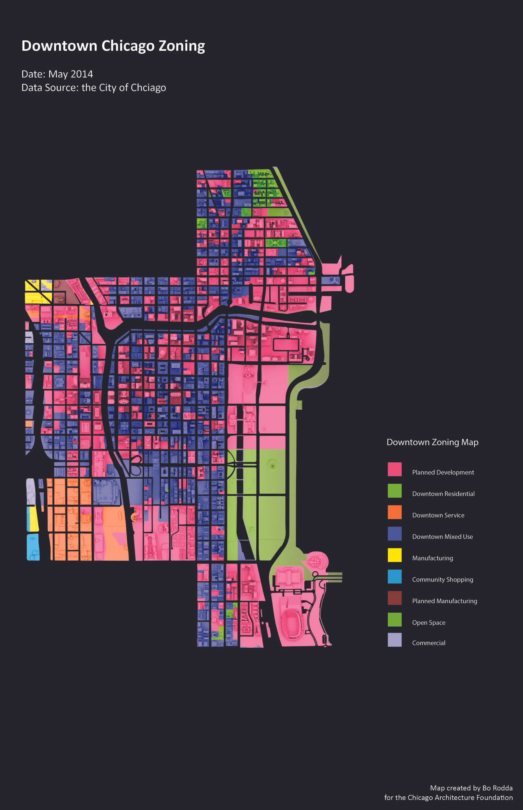
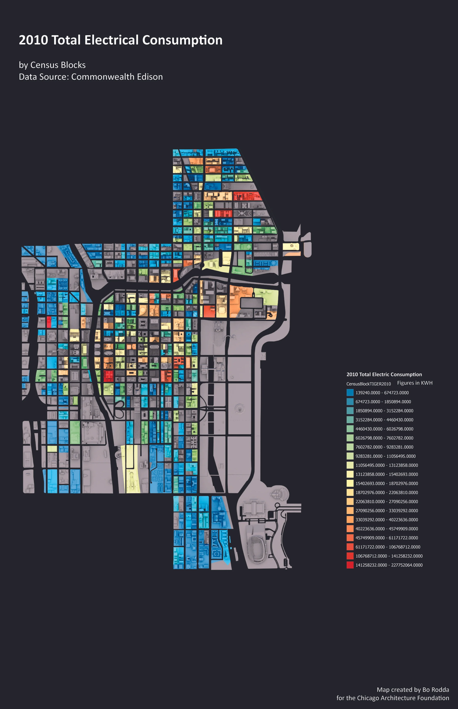
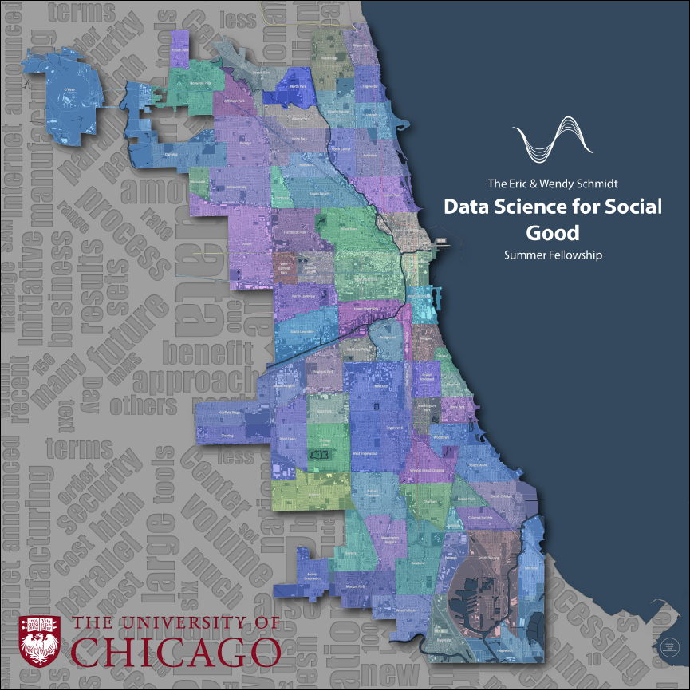
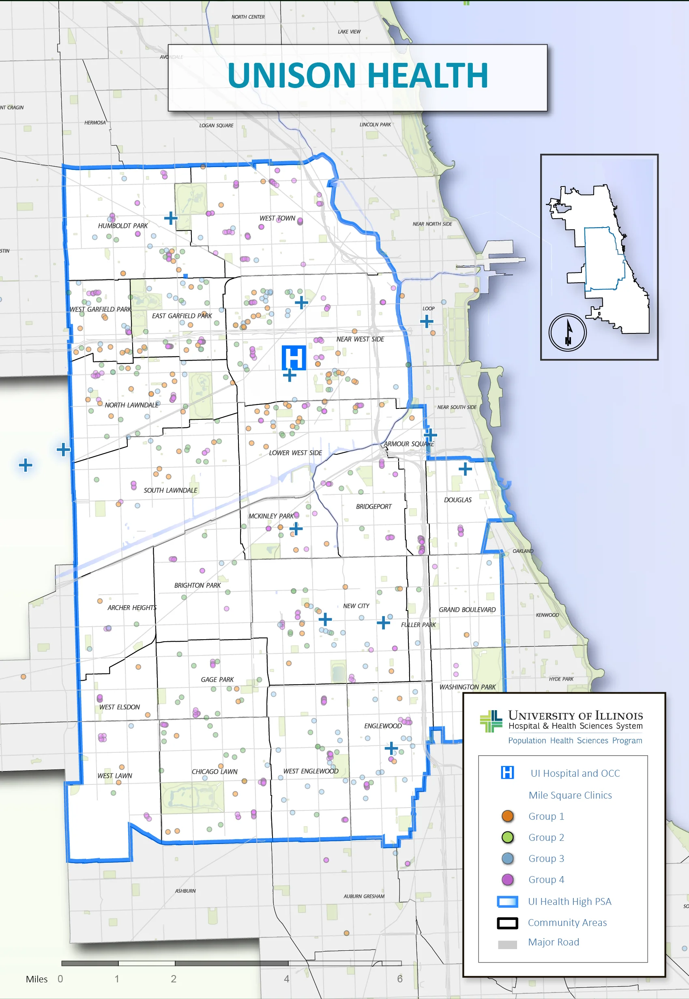

**Visualizations at a scale you walk across, not scroll through.**

City of Big Data Maps was a sequence of large-format visualization works produced for the [Chicago Architecture Foundation's](https://www.architecture.org) *City of Big Data* exhibition in 2014, drawing on Chicago's open-data infrastructure to render the city's underlying systems at exhibition scale. The work tested how analytic visualizations behave when scaled past the laptop screen and into the physical space of a public exhibition, where readers move bodily across the map rather than mousing over it.

The series included visualizations of Chicago zoning, building-age distribution, and 2010 electrical consumption — each composed at print sizes large enough to support reading from across a room and detail-reading from a few feet away. The argument the work made was that the same data set behaves like a different argument depending on the medium it's published in: the dashboard, the academic paper, and the exhibition print are not interchangeable surfaces.

## Sub-projects in the same series

A pair of related maps grew out of the same line of work in 2014–2015 and are functionally part of the City of Big Data series:

**Data Science for Social Good Map (DSSG).** Produced for the [Data Science for the Social Good](https://www.dssgfellowship.org) Summer Fellowship program, using Chicago open-data layers and finished at 96-by-96 inches, printed on fabric.

**UIC Unison Health Map.** Produced for the University of Illinois at Chicago's Population Health Sciences group, mapping the UI Health community-clinic network across the city. The work was part of my Research Fellow appointment at UIC (2014–2015), where I served as GIS and Data Visualization Specialist alongside the UrbanCCD work.

What threads through all of these is a single proposition: that Chicago's open-data infrastructure can be made to do design work as well as analytic work — that the maps a city produces about itself can be objects of attention, not just utilities. The arguments developed here continue in the [Visualization as Humanistic Medium](/research/visualization-as-humanistic-medium/) research strand.
