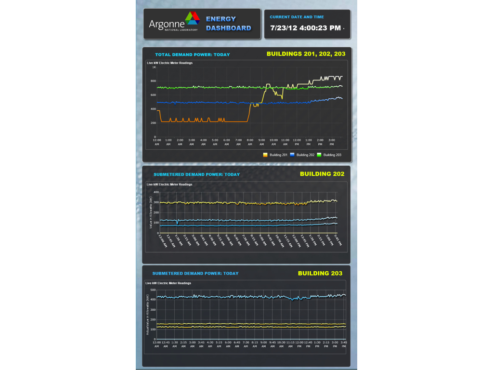
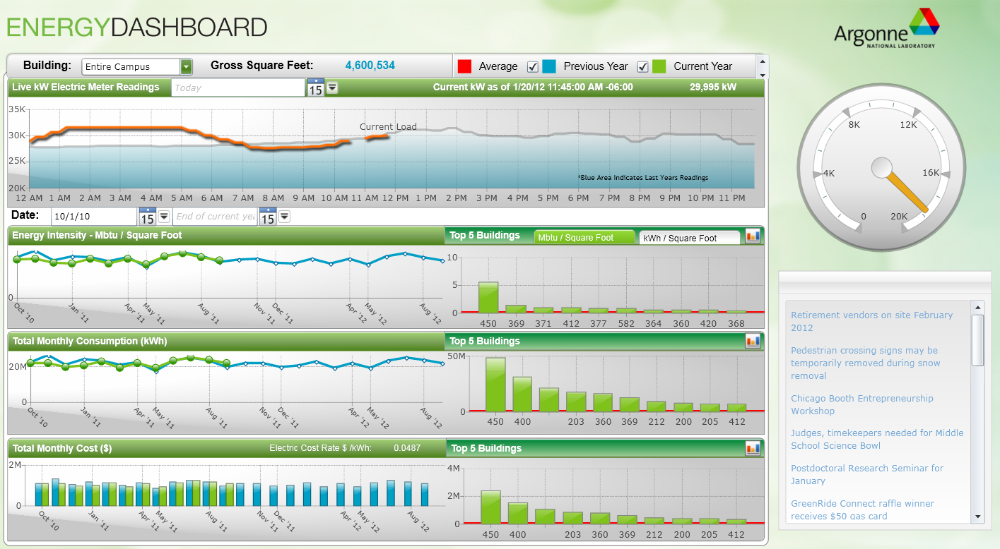

**A real-time energy monitoring and visualization platform for Illinois's largest energy consumer.**

The Argonne Energy Management Information System (AEMIS) was a centralized data platform that pulled energy data from smart meters across the entirety of [Argonne National Laboratory's](https://www.anl.gov) campus into a single MSSQL infrastructure, then surfaced it through dashboards designed for both sustainability staff and a broader laboratory audience.

I served as Principal System Architect during my pre-faculty appointment at Argonne (2010–2012), where I was Building Intelligence and Energy Efficiency Specialist in the Computation and Informational Sciences Division, in the Office of the Chief Information Officer. The system was the lead deliverable of that role; total project funding exceeded two million dollars.

What made the project a research problem rather than an engineering one was the audience question. Energy data at this scale is plentiful but illegible: metered to fifteen-minute resolution, normalized across heterogeneous building types, dependent on weather and occupancy variables that have to be controlled for before any reading is honest. Most energy dashboards treat the dashboard as a *display* — an output device for the data already produced. AEMIS treated the dashboard as a *medium* — a designed surface that determines which questions can even be asked of the data, and by whom.

The work positioned the dashboard as part of Argonne's sustainability communication strategy: not an internal compliance tool but an artifact that staff, leadership, and visiting researchers could read and use. That framing — visualization as a humanistic medium of argument, not a passive surface of analysis — has been the through-line of nearly every project since.

In parallel I led the deployment of the Advanced Wireless Environmental and Energy Monitoring Sensor Mesh: 50+ wireless sensor nodes supporting 250+ thermal data points, enabling real-time PUE calculation and heat-map visualization at the [Argonne Leadership Computing Facility](https://www.alcf.anl.gov). I also served on the Argonne Sustainability Council and was a contributing author on the *Argonne Sustainability Plan FY11* and *FY12*.
