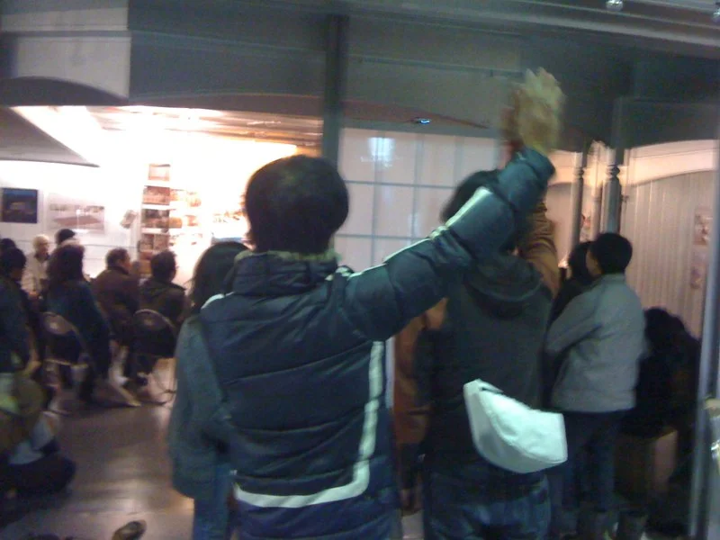
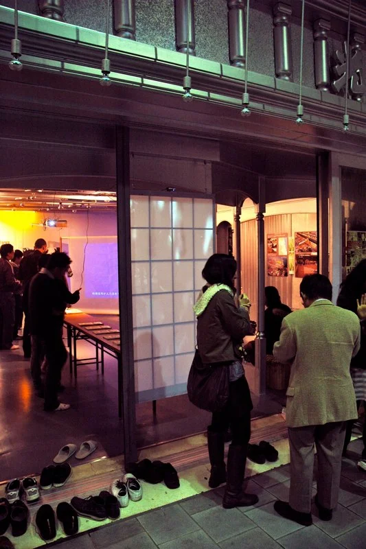

**An interactive artwork exploring the potential of activated architecture.**

(re)ACT is a responsive architectural surface that engages viewers visually and kinetically. Visitors see themselves projected through a traditional Shoji screen, where their movements generate visual elements featuring the letters "(Re)" and a Chinese character meaning *to change, to rebuild, to remake.* The symbols network and interact while responding to each viewer's movement, the work reading the body and writing it back into the screen as projected pattern.

The Shoji screen — a centuries-old translucent rice-paper-and-wood divider with deep architectural history in Japan — was chosen deliberately. Its translucency makes it ideal for rear projection, but more importantly the work stages a juxtaposition of tradition and digital innovation: a familiar quiet object, suddenly responsive.

The work was installed at Platform 01 in Beppu, Ōita, Japan as part of *Re:*, the 2010 GFRY Design Studio exhibition. GFRY Studio is the interdisciplinary research studio at the [School of the Art Institute of Chicago](https://www.saic.edu) where I completed my MFA thesis the same year.
